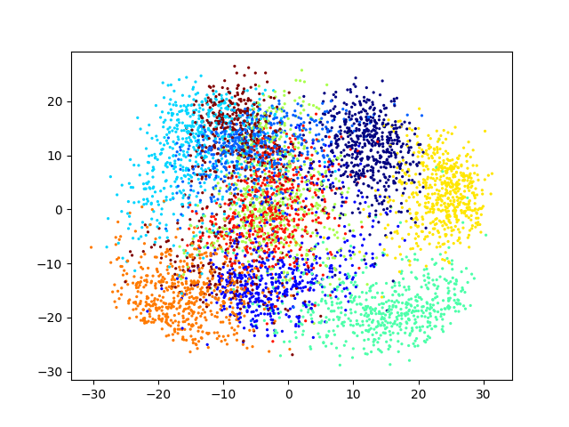

# Project 6 Visualization

### Purpose of this project:
- Gain a basic appreciation of data science programming and data visualization
- Implement a data science algorithm with given pseudocode
- Be aware of efficiency of the implemented code

In this project we implemented three different methods of visualizing data; PCA, Isomap and t-SNE.

The data we are trying to visualize are the following: Swiss Roll and OptDigits:

Swiss Roll looks like this:


Whilst OptDigits is a dataset where there are 64 features, and is thus not possible to visualize without transforming first.


### Running the project
Python 3+ is required to run the project.  
Install the required dependencies by running 
```pip install -r requirements.txt```

To run the three different visualization algorithms, run the main.py file.

The results should be something like this:


### Results of PCA

##### Swiss Roll:

We see that the Swiss Roll is reduced to two dimensions such that the curl is visualized.

##### OptDigits:

We see that applying PCA to OptDigits yields poor results. 


#### Results of Isomap
##### Swiss Roll:

We see that the Swiss Roll is reduced to two dimensions such that the roll is 'Rolled out'.

##### OptDigits:

We see that applying PCA to OptDigits is better than PCA, but it still fails to distinguish the different clusters. 

#### Results of t-SNE on OptiDigits

Here we can see that applying t-SNE to the OptiDigits dataset clearly distinguishes the different clusters.